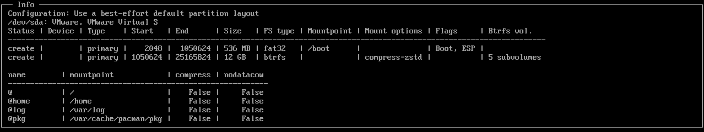

# Install Arch Linux

## Boot the live environment

Update `archlinux-keyring` and `archinstall` packages:

```sh
pacman -Sy archlinux-keyring archinstall
```

Edit `/etc/pacman.conf` and add the following line:

```sh title="/etc/pacman.conf"
ParallelDownloads = 10
```

Run the archinstall script:

```sh title="archinstall"
archinstall
```

## Set up the system

Set the following options:

```sh
Archinstalll language: English
Mirrors: Netherlands
Locales:
  Keyboard layout: us
  Locale language: en_US
  Locale encodeing: UTF-8
Disk configuration:
```



```sh
Disk encryption: No
Bootloader: systemd-boot
Swap: True
Hostname: arch
Root password: ******
User account:
  username: tychob
  password: ******
  sudo: True
Profile:
  Type: Desktop - KDE Plasma - Kwin
  Graphics drivers: Nvidia (proprietary)
  Greeter: sddm
Audio: Pipewire
Kernels: linux-zen
Additional packages: git
Network configuration:
  Network interface: NetworkManager
Timezone: Europe/Amsterdam
Automatic time sync (NTP): True
Optional repositories: multilib
```

## Reboot

Reboot the system into the new installation:

## Post-installation

clone the dotfiles repo:

```sh
mkdir ~/Repositories
cd ~/Repositories
git clone https://github.com/TychoBrouwer/arch-install.git
cd arch-install
```

Complete the config.json file and run the install script:

```sh
./install.sh
```
